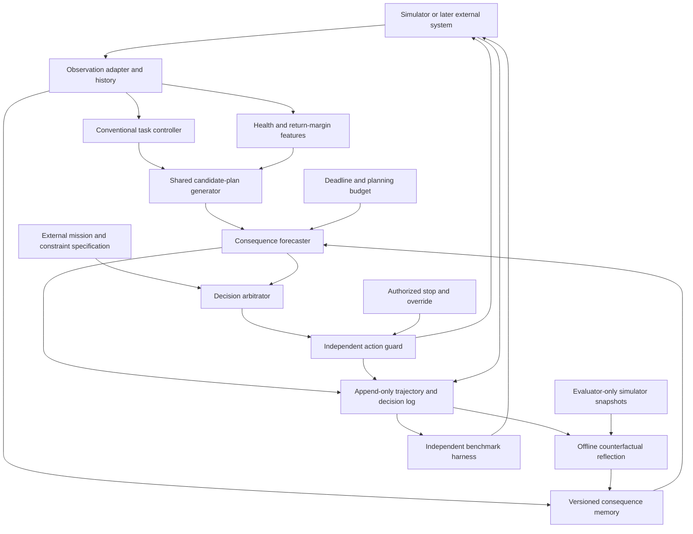

# AACE build specification

Proposed on October 2, 2026. This is an implementation design, not an implemented or validated system. It complements the [original architecture](AACE_ARCHITECTURE.md) and the [project assessment](../PROJECT_REVIEW_AND_WORKING_PLAN.md).

**Current implementation authority:** the [reviewed implementation master plan](../IMPLEMENTATION_MASTER_PLAN.md) incorporates the confirmed laptop/budget and transparent-demo requirement. Follow its updated build order: oracle adapters verify correctness; the learned-model comparisons establish whether memory adds value. A perfect-model planner is an upper-bound control, not a compulsory memory-win gate.

The October 3 [fear, survival, intuition and pressure extension](FEAR_SURVIVAL_AND_PRESSURE_PLAN.md) specifies the proposed threat/resource state, fast response and bounded scheduling experiments. It leaves the primary memory comparison identifiable and does not describe implemented features.

## Architecture decision

Start with a Python research package and one simulator. Keep the task controller conventional, the experiment harness independent, and the reflection worker outside the real-time action loop. First isolate simulator-grounded memory, then replace simulator access with learned predictions. Add threat modes and adaptive compute only as independently tested features.

The research package has three execution paths:

1. **Online decision:** observation → state/history → candidate plans → consequence estimates and memory evidence → authorized arbitration → external action guard → applied action.
2. **Offline reflection:** logged event → restored branch point → admissible alternative plans → paired rollouts → qualified lesson → versioned memory.
3. **Evaluation:** fixed scenario manifest → identical exposure/resource budgets → multiple controllers → audited outcomes and uncertainty estimates.



The oracle snapshot path is authorized only for simulator-grounded reflection and evaluation. In the initial upper-bound experiment, a separately labeled simulator forecaster can also access snapshots, with exactly the same access for its reference planners. The learned online forecaster never receives hidden simulator state or future random draws.

## First environment: a rover with persistent capability loss

Build a small two-dimensional vector-state environment before adding a physics engine. Use it to test logic and branching, then validate promising results in a Safety-Gymnasium/MuJoCo variant. The small environment is a controlled benchmark, not evidence of realistic rover dynamics.

Proposed starting configuration, to be adjusted using training/validation pilots and frozen before testing:

| Property | Definition |
|---|---|
| Task | Reach an inspection waypoint and return to a depot before a deadline |
| State | Position, velocity, battery, actuator-health fraction, mission progress, local terrain and environment state |
| Action | Two bounded continuous acceleration commands; shared plan primitives generate these commands |
| Simulation clock | 0.1-second timestep; initial maximum 500 steps per episode |
| Damage | Health decreases after impacts or sustained traction stress; lower health reduces maximum acceleration and increases energy use |
| Battery | Movement and idle operation consume energy; battery depletion away from a recoverable depot state ends useful operation |
| Recoverable event | Reduced traction or limited damage from which an admissible return/stop remains feasible |
| Catastrophe | Irreversible trap, total actuator loss, or loss of return capability followed by unrecoverable depletion; specify each predicate in the environment |
| Mission failure | Deadline missed or authorized task abandoned; tracked separately from machine catastrophe |
| Safe terminal outcome | Successful return or externally permitted recoverable abort |
| Partial observation | Later hide terrain grip and add noisy health measurements; true hidden values remain evaluator-only |
| No-op | Zero commanded acceleration while physics, resource drain and mission time continue |

Do not equate no-op with braking or retreat. Their dynamics differ. An authorized stop must have a defined physical response and may still carry unavoidable damage.

Create separate scenario groups: benign control; unnecessary-risk shortcut; high-stakes shortcut with an explicitly allowed machine-risk budget; inaction with worsening consequences; recoverable degradation; irreversible trap; and contradictory/stale-memory cases. Externally specified stakes are observed by every agent.

Use three distinct holdouts: appearance change with the same mechanism, an unseen parameter combination of a known mechanism, and an unseen mechanism. A novel surface with the same traction dynamics tests representation transfer; it does not establish learning a previously unknown physical law.

The environment must support full state and RNG snapshot/restore, deterministic replay for a fixed seed, independent branch execution, explicit event predicates, and versioned train/validation/test manifests. Keep evaluator labels in a separate interface so ordinary `info` fields cannot accidentally reveal hazard identity or future failure to a controller.

## Modules and contracts

All records carry a schema version. Forecasts and memories also identify environment, model, mission-policy and continuation-policy versions. Times are recorded in simulation units and wall-clock units separately.

| Module | Input → output | Responsibility and boundary |
|---|---|---|
| Observation adapter | Raw permitted telemetry → observation/history with timestamps and masks | Normalize visible data; never add hidden state |
| Task controller | Observation/history and mission context → proposed command | SAC for the initial fully observed run; frozen during the first memory comparison |
| Health features | Visible health and route estimates → margins, confidence and recovery cues | Use explicit one-sided/interval limits; call these proxies rather than certified viability |
| Candidate generator | Proposed command, recovery primitives and constraints → common candidate plans | Always include nominal action, braking, no-op and feasible retreat/return candidates |
| Forecaster | Belief/history, candidate plan, horizon and continuation → outcome distribution | Predict reward, mission failure, capability loss, catastrophe, recovery and uncertainty separately |
| Memory store | Observable context and action family → qualified evidence records | Retrieve examples and propose tested alternatives; no automatic prohibitions |
| Budget controller | Scheduling score, deadline and resource ledger → allowed queries/horizon | Fixed allocation first; threat-conditioned allocation later |
| Arbitrator | Admissible plans, forecasts and external priorities → chosen plan and decision trace | Apply one declared objective; modes cannot silently change mission authority |
| Action guard | Chosen command and external override → applied command or explicit failure | Independent of learned memory/risk; last authority before execution |
| Reflection worker | Event, permitted branch access and query cap → scar, revision or abstention | Offline; never blocks the next control action |
| Harness/reporting | Manifest, controller artifact and resource caps → episode results and comparison report | Own splits, accounting, evaluation labels and statistical analysis |

Use a fixed history window equally for all methods before introducing recurrent networks. If partial observability requires longer memory, use a common recurrent actor configuration such as [Recurrent PPO](https://sb3-contrib.readthedocs.io/en/master/modules/ppo_recurrent.html) across the relevant comparison. Do not compare a recurrent AACE against a memoryless reference and attribute the difference to scars.

## Decision semantics

The authority ordering is:

1. Authenticated external stop/override and immutable external constraints.
2. Explicitly authorized protected outcomes and mission priorities.
3. Machine preservation and recovery according to that mission's risk budget.
4. Task efficiency and optional preferences.

An ordinary mission can specify that machine damage dominates task value. Another can explicitly permit greater machine risk. Those are different mission specifications, not a learned controller changing the rules. Protected-asset budgets and hard constraints cannot be purchased with extra reward. Override is handled directly by the guard and cannot be rejected by the learned arbitrator.

For each decision, first construct the admissible candidate set. Within it, choose the plan with the highest externally defined consequence utility subject to the mission's declared risk constraints. Define the loss components and units once: mission failure, protected loss and machine capability loss. Report catastrophe probability as a risk metric/constraint; do not repeatedly penalize the same loss under several names without an explicit objective justification.

For sampled loss `L`, implement tail loss using the general form:

`CVaR_alpha(L) = min_eta [eta + E(max(L − eta, 0)) / (1 − alpha)]`

This handles discrete losses as well as continuous ones. The original conditional-tail formula is qualified for continuous losses and should not be copied blindly for binary catastrophes.

Forecast metadata must make the target explicit: probability of catastrophe over horizon `H`, conditional on the candidate plan and a specified continuation controller. Estimate danger at multiple horizons if needed; keep calibration results separate by horizon. A changed controller changes the target distribution.

The composite threat/scheduling score may combine probability, severity, uncertainty and recovery margin, but it is **not** itself a catastrophe probability. Ensemble disagreement is a heuristic uncertainty measure, not a guaranteed upper bound on real risk. Calibration must be checked on independent validation trajectories, including after policy changes.

Start with a fixed planner: a shared set of candidate plan primitives, short sampled rollouts, and a declared terminal return-margin estimate. Initial horizons of 20 and 50 steps are engineering starting points. Horizon sensitivity is required because a 2–5 second lookahead alone can miss eventual battery stranding. Record terminal-value approximation error.

Compare plan alternatives with identical horizons and candidate support. An oracle regret metric is relative to this declared candidate set and continuation, not a claim of globally optimal behavior.

## Modes, deadlines and failure behavior

Modes are optional scheduling states: normal, alert and critical. Reflect is a separate offline job, not an online mode that prevents action. Add hysteresis and a minimum dwell rule after fixed-planner results exist. At every mode the same mission specification applies; critical mode increases recovery readiness and chooses from admissible plans under that specification.

For the proposed 10 Hz simulator, use a provisional 100 ms wall-clock action deadline. Measure actual p50, p95 and p99 latency on declared hardware. Bound forecast queries, candidate count, memory retrieval count and horizon. If planning exceeds the deadline, execute a prevalidated fallback chosen for the current context. Stop/override bypasses the planner immediately. This simulator timing is not a hardware safety certification.

Do not assume safe stop is always safe. Validate fallback behavior for movement, slipping and dwindling energy. If no action satisfies the declared constraints, log infeasibility and execute the externally specified emergency response; do not claim safety or invent an override to the constraints.

Missing telemetry, invalid forecasts, model-version mismatches and memory corruption produce explicit statuses. Uncertain evidence may cause information gathering, conservative fallback or advisory abstention according to the mission policy. It must not silently become a fabricated precise probability.

In the simulator, run matched shielded and unshielded research comparisons where appropriate. A shield that blocks every damaging event can conceal the proposed mechanism's effect. No unshielded result licenses physical operation. The guard's guarantees are limited to its declared rules and assumptions.

## Counterfactual reflection and memory lifecycle

Trigger reflection after a catastrophe or a simulator-defined near-miss. Begin with at most ten prior decision points and a fixed alternative/query budget per event. These are tunable validation parameters, not theoretically optimal choices.

For each branch point:

1. Restore the same pre-decision state and history.
2. Compare the actual decision with feasible alternatives, using shared exogenous noise where the simulator supports meaningful coupling.
3. Repeat across independently sampled noise streams; one favorable alternate rollout is insufficient evidence.
4. Hold the continuation controller fixed when estimating the effect of one action. If an alternative changes the whole plan, label it plan-level recourse.
5. Measure risk and authorized-utility differences, uncertainty and damage persistence.
6. Retain a lesson only when the improvement meets the predeclared confidence rule; otherwise abstain.

Paired simulator interventions provide evidence under that simulator. They do not establish a uniquely responsible action in the real world. Learned-model reflection must first demonstrate agreement with withheld simulator branches before being allowed to create high-confidence memories.

A scar record contains observable context/history features, dangerous action/plan family, tested alternative, mission context, actual outcome, risk/utility differences and intervals, evidence type, branch-query count, continuation/model/environment versions, age, confirmations, contradictions and status. Hidden simulator features are prohibited from the retrieval key, even when reflection used an oracle snapshot.

Start with structured features and a bounded table, using nearest-neighbor retrieval over normalized visible quantities. Avoid a learned embedding or vector database until simpler features fail. Memory can add a previously verified alternative to the common candidate pool and request its re-evaluation; a strong reference gets an equal-cost expanded search or episodic-retrieval control. Memory does not directly add an uncalibrated penalty to forecast probability.

Records progress through provisional → verified → revised/retired. Contradictory benign evidence reduces applicability; dynamics/model changes require revalidation. A high-stakes decision retrieves the same warning but recomputes its value under current authority. Freeze memory during ordinary final evaluation; allow updates only inside the explicitly paired one/few-event adaptation protocol. Initial candidates must include both empty-memory and frozen-preexisting-memory conditions.

## Data, learning and reproducibility

Each trajectory records permitted observations, proposed and applied actions, reward, separate costs, damage, mission context, termination reason, guard interventions, forecasts, decision mode, memory versions, latency and resource counts. Store privileged evaluation truth and snapshots separately with explicit access controls.

Record Gymnasium `terminated` and `truncated` separately. A time limit is not automatically a catastrophe, and successful completion is not automatically ordinary independent censoring for a time-to-failure analysis. Define competing outcomes and at-risk denominators in the report. The [Gymnasium time-limit guidance](https://gymnasium.farama.org/main/tutorials/handling_time_limits/) explains the API distinction.

SAC replay uses the applied command and resulting transition. Retain the proposed command only in the audit record. Counting an overridden command as the executed action corrupts the dynamics targets. If the actor is frozen during the first comparison, report that explicitly. Later joint training must account for gate changes and policy-dependent risk labels.

Begin with small probabilistic vector-state dynamics models and a horizon-specific calibrated catastrophe predictor. Train on training trajectories, calibrate on validation data, then freeze for testing. Keep original-distribution frequencies/weights when using class balancing; otherwise predicted probabilities can inherit an artificial event prevalence. Stress-search trajectories are a separate diagnostic dataset unless a valid sampling correction is defined.

Use local JSON metadata plus array/columnar trajectories and checkpoints. Keep run configuration, code revision, dependency lock, seed, scenario manifest, branch-query counts and model/memory versions with each artifact. A report must be reproducible from those artifacts without retraining.

## Planned repository layout and stack

The following is proposed, not created during this review:

```text
src/aace/
  envs/           # rover dynamics, event predicates, snapshots, observation boundary
  interfaces/     # records, controller and forecast protocols, schema versions
  controllers/    # task, recovery, fixed and context-conditioned references
  forecasting/    # simulator adapter, learned dynamics, hazard and calibration
  decision/       # candidate generation, mission constraints, arbitration, deadlines
  memory/         # retrieval, evidence, contradiction and version lifecycle
  reflection/     # branch selection, paired rollout evaluation, abstention
  evaluation/     # manifests, budget ledger, metrics, uncertainty and reports
configs/          # environment, mission, methods, seeds and resource caps
tests/            # meaningful invariants and integration checks
scripts/          # train, evaluate, replay, reflect and reproduce report
artifacts/        # generated runs; keep large outputs out of ordinary source history
```

Use NumPy/Gymnasium for the first simulator and PyTorch with an established SAC implementation for the first actor. Use common wrappers across methods. Use an isolated [OmniSafe](https://github.com/PKU-Alignment/omnisafe) environment for established constrained references, and a separate [SafeDreamer](https://github.com/PKU-Alignment/SafeDreamer) reproduction environment. Exchange versioned trajectory/results schemas rather than library internals. Pin working dependencies only after smoke tests; upstream examples have different age/platform assumptions.

Build the requested local transparent-decision demo from the same structured records and controller package. Start with replay and a decision inspector, then add learned forecasts and before/after incident comparisons as their components pass verification. Keep rendering outside the action loop. Produce comparison tables, risk/calibration plots and replay artifacts alongside the viewer. A customer advisory adapter can later expose episode analysis and incident reports without giving the package production action authority.

## Definition of architecture completion

The first architecture milestone is complete when snapshot replay is exact, observation permissions are verified, no-op and damage have persistent consequences, every reference uses the same mission specification, memory abstains on uncertain evidence, and evaluation accounts for all online and reflection work. Scientific success additionally requires the performance gates in the [roadmap](../04_Experiments/EXECUTION_ROADMAP.md); wiring every block is not sufficient.
