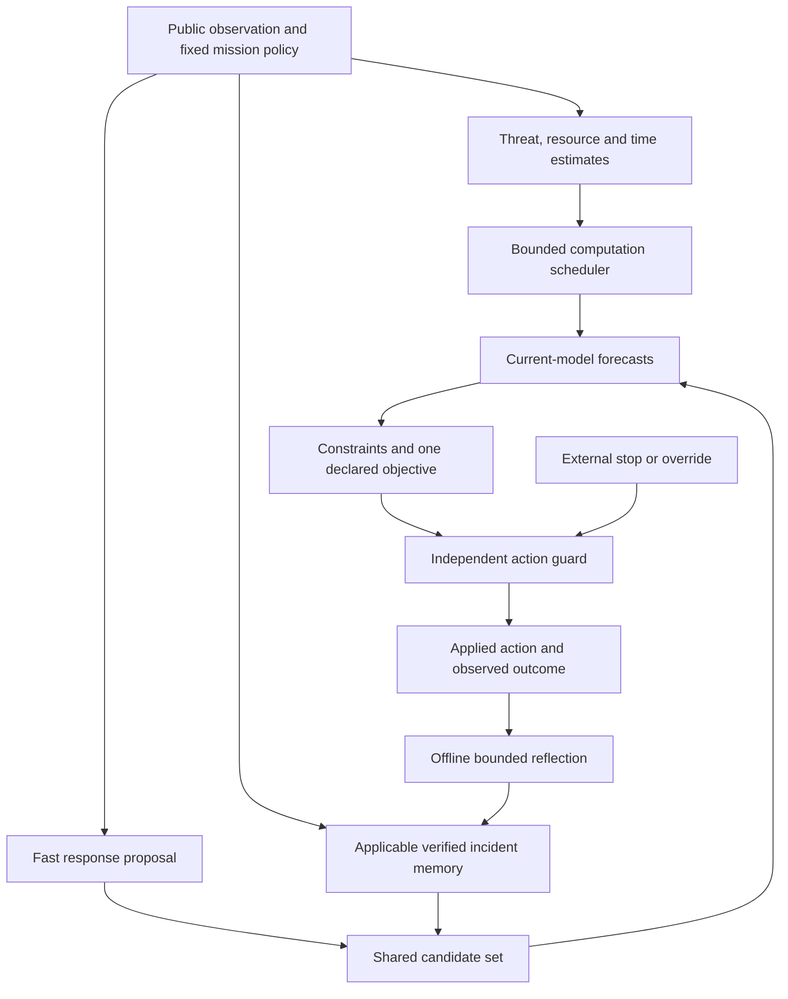

# Fear, survival, intuition and pressure in VALOR

**Date:** October 3, 2026. **Status:** research design, not implemented behavior.  
**Authority:** extends the [implementation master plan](../IMPLEMENTATION_MASTER_PLAN.md), especially the threat model, mission policy, recovery and E5 experiments.  
**User direction:** consider fear, survival instincts, gut decisions, time bounds and pressure together. Preserve the [premium interface direction](../UI_DESIGN_PRINCIPLES.md).

## 1. What we aim to achieve

Test whether an agent can recognize familiar danger quickly, preserve the resources needed to act, spend its limited thinking time where it matters, and revise an inappropriate warning after conditions change. Measure improvement in complete missions, repeated avoidable failures and computational cost. Human concepts inspire the mechanism; the experiment does not establish emotions, consciousness or a model of human cognition.

Keep the primary AACE question identifiable: does verified counterfactual memory outperform equally resourced simpler methods? Threat and resource models fit the existing architecture; adaptive scheduling, learned reflexes and explicit modes are staged extension experiments. Do not turn on every component before finding which one causes a result.

## 2. Translate the concepts into measurable mechanisms

| Concept | Proposed computation | Permitted influence | What to measure |
|---|---|---|---|
| Fear | Candidate/continuation-conditioned forecast of damage or machine failure over a stated horizon | Prioritize checking hazards and propose recovery; use calibrated risk under the common mission policy | Forecast reliability, missed hazards, false alarms and recurrence |
| Survival | Estimated energy, time and movement margins for completing or recovering from the mission | Include feasible return/recovery alternatives and expose shrinking margins | Completion, depletion, capability loss and unnecessary abandonment |
| Gut instinct | Fast response learned from experience, or shared fixed recovery primitives initially | Propose an action without a full new search when its validated applicability permits | Decision latency, useful coverage, regret, false responses and shift failures |
| Pressure | Remaining task slack, action-time budget, consequence severity and uncertainty | Allocate the limited planning budget, switch response path, or report infeasibility | Deadline misses, completion, risk and computation work |
| Confidence | Calibration and applicability evidence for a forecast or response | Request more checking or abstain when evidence is inadequate | Reliability, selective error and coverage |
| Experience | Qualified incident memory with tested alternatives and contradictory evidence | Suggest a recourse or trigger rechecking of assumptions | Improvement after exposure and retirement of stale lessons |

Confidence is not a second emotional score. Uncertainty is not automatically danger, and familiar appearance is not proof of safety. Keep task failure, recoverable damage and machine catastrophe as different outcomes.

## 3. Architecture

Retain the existing small CPU models. Reuse the learned ensemble and compact threat head before considering another network. A small fast policy is conditional on evidence that fixed recovery primitives or the nominal policy cannot provide an adequate fast response. No LLM, physiological sensors or large foundation model is required.

Every controller retains the same public observation permissions. Memories and learned reflexes cannot use hidden scenario identifiers or the actual future disturbance sequence. Privileged simulator branches remain labeled evaluator/oracle evidence, not online input for a learned-only controller.

## 4. Fear as threat learning

Initially estimate failure from the common forecast rollouts. Later test a compact head predicting a declared event within a fixed horizon under a specified action/continuation. A probability for one continuation is not valid for every action.

Train using observed outcomes, with episode-separated train/validation/test data. Record class balance, exposure and the continuation policy. Handle unobserved future windows and competing endings explicitly: completion is not catastrophe, a training truncation is not mission death, and an interrupted trajectory may leave a future-event label unknown.

Validate with proper scoring rules, threshold reliability, rare-event coverage and performance after a policy or dynamics change. Unknown risk stays unknown. Ensemble disagreement and a composite alert score may guide scheduling, but neither is automatically a calibrated catastrophe probability.

A high threat signal can propose slowing, a detour, return or further checking. It does not create an automatic permanent ban. Maintain one accounting model for damage and mission consequences; do not subtract the same predicted damage under reward, fear, memory, survival and urgency simultaneously. A fear-shaped objective can be a separately labeled comparator with a fair tuning budget.

## 5. Survival as resource feasibility

Use model-dependent estimates of three margins:

- **Energy margin:** available battery minus estimated energy to finish or return under a declared continuation, including damage and idle costs.
- **Time margin:** remaining mission time minus estimated time to inspect and return, or to reach an authorized recovery outcome.
- **Movement margin:** available capability compared with the demands of the relevant maneuver or recovery plan.

Compare these with simple battery/time thresholds and the existing return-reserve heuristic. A point estimate or validation-selected conservative estimate is not a certified viable set. Log uncertainty, failed predictions and the distribution on which an estimate was validated.

Preserving the machine is a task objective or constraint specified by the human mission policy. If a later task explicitly permits damage to protect a higher-priority outcome, the system must represent that policy. It must not learn an overriding goal of keeping itself running. External stop and shutdown remain authoritative.

## 6. Intuition as a fast response path

Begin with shared braking, return and detour primitives that are available to all relevant controls. A later learned response may propose a context-conditioned action directly, representing a compressed pattern learned from experience rather than a fresh multi-plan rollout.

If the fast response is distilled from planner decisions, count teacher rollouts, training examples and gradient updates. Make equivalent evidence available to the comparison methods. Do not give the hybrid extra training and attribute its benefit to intuition alone.

Define validation-selected applicability and abstention rules. Familiarity can support fast execution only in its tested domain. A familiar-looking hazard with changed dynamics can be exactly where the response is wrong. Report disagreement with the planner and cases in which the fast response was better, worse or unassessable.

Intuition and planning are both learned/computational mechanisms. We test which path is useful under which resource constraints, rather than assuming either is inherently superior.

## 7. Time bounds and pressure

There are two distinct clocks:

1. **Mission time:** the simulator's elapsed time and external deadline. Remaining task time is part of the public state.
2. **Action computation time:** wall-clock time available to produce a command on the laptop.

The current demo advances numerical physics when an action is applied; browser playback speed does not make a mission easier or change its deadline. Slow computation does not currently advance physics continuously. Do not describe it as a real-time pressure benchmark.

First test simulated urgency with ample computation time. Then test bounded computation under the same timing rules for every method. A further benchmark may explicitly advance the world during decision latency, applying a defined held-action/fallback policy. Disclose that altered environment and charge the same delay consequences to all methods. Injected delay and measured laptop delay are separate conditions.

The provisional 100 ms action budget is a profiling target, not a guarantee. Compare validation-selected feasible budgets and report distributions of elapsed time and misses. A Python timeout checked after a blocking forecast returns is not a preemptive deadline mechanism.

An eventual deadline implementation needs bounded planning chunks or isolated workers, a current fallback, state/action generation identifiers and a check before action commit. Discard expired or superseded results. An external override received during planning must be checked before any new action is committed. The current demo has not established these in-flight deadline/override guarantees.

Pressure comes from declining completion slack and recovery margin. It can change candidate order, planning effort or whether a validated fast response is used. It cannot silently raise the mission's risk limit or weaken immutable constraints. When the task is infeasible, report that outcome and choose according to the declared recovery policy; do not fabricate a successful plan.

## 8. Arbitration without an arbitrary emotion stack

Start with continuously conditioned scheduling using observable margins, uncertainty and an explicit budget. Keep the original fixed-budget planner as a strong reference. Test Normal/Alert/Critical mode labels only if they add value beyond continuous conditioning. If modes are used, validate hysteresis/dwell behavior and permit immediate escalation for critical conditions.

At each decision:

1. Check current override, telemetry validity and action deadline.
2. Obtain public threat/resource estimates and record unknown quantities.
3. Generate the fast proposal and common recovery/task candidates.
4. Retrieve relevant incident evidence within a bounded lookup budget.
5. Schedule candidate forecasts without exceeding the resource cap.
6. Apply the unchanged mission constraints and objective.
7. Choose the best supported admissible option, or a declared context-dependent fallback.
8. Recheck override, state/version and deadline before committing the guarded action.
9. Record both the proposal and applied action, then the observed outcome.
10. Queue bounded reflection outside the online action loop when appropriate.

Braking is not universally best: it consumes time and idle energy, and may not prevent an existing failure. Returning, stopping, controlled continuation or advisory abstention can be appropriate only as specified and validated for that context. Unexplored choices stay distinct from constraint-rejected ones.

## 9. Scenarios that expose the important tradeoffs

| Scenario family | Question |
|---|---|
| Familiar hazard after limited failure exposure | Does memory or a fast warning prevent the same avoidable incident? |
| Unfamiliar hazard or misleading familiar appearance | Does the agent detect inadequate evidence rather than trust an unsupported reflex? |
| Terrain that has become less damaging | Does it revise a stale warning and avoid permanent excessive caution? |
| Low battery with a long safe detour | Does it account for the return journey rather than avoiding damage at any cost? |
| Feasible, marginal and impossible mission deadlines | Does urgency improve useful scheduling without unauthorized risk escalation? |
| Ambiguous predictions and disagreement | Is additional computation worth its measured cost? |
| Planning stalls or latency bursts | Are late results discarded and fallback/deadline events visible? |
| Stop during an in-flight decision | Is the override respected before committing a new action? |
| Context explicitly permitting machine damage, later extension | Does external mission priority prevail over learned machine-preservation preference? |

Vary one factor at a time initially. Deliberately impossible deadlines test truthful infeasibility handling; they are not opportunities to demand higher completion through impossible physics.

## 10. Experiment sequence and attribution

Keep E1–E4 primary memory controls intact. Extend E5 in small phases:

| Extension | Minimum useful comparison |
|---|---|
| E5a: threat assistance | Same planner with/without threat assistance; simple hazard rule and separately tuned fear-shaped control |
| E5b: resource awareness | Learned resource margins versus direct battery/time thresholds and the existing return heuristic |
| E5c: fast/slow choice | Fast response alone, fixed planner alone and hybrid, with matched evidence and logged compute |
| E5d: adaptive computation | Adaptive allocation versus smaller/larger fixed budgets at equal average work and common worst-case timing rules |
| E5e: memory interaction | Targeted memory off/on × hybrid off/on, after component checks, to separate memory from scheduling effects |
| E5f: pressure and revision | Deadline sweeps, latency conditions, changed terrain and stale-warning tests |

Match policy/model access, training data, incident packages, teacher/reflection work, update budgets, tuning trials and mission rules where required. Include scalar risk/resource-conditioned planning as a serious simpler reference. Count scheduler/threat inference, memory retrieval and abandoned/late rollouts, not just useful forecast work.

Use development seeds for debugging and validation to choose thresholds, switching rules and budgets. Freeze the prospective protocol before final testing; use independent training replications and the master plan's clustered reporting rules. Avoid a full combinatorial grid on the laptop: screen components, then test a targeted interaction. Any final extension claim needs its own declared endpoint and uncertainty analysis.

Report completion, machine catastrophe, repeated avoidable incidents, damage, depletion, aborts, deadline misses, false warnings, unnecessary avoidance and selective-response coverage. Also report p50/p95/p99 action latency, computation deadline misses, fallback use, planning work and total adaptation/reflection cost. A rover that never leaves home does not pass because its damage rate is low.

Keep a mechanism only if it improves a declared completion/risk/latency tradeoff beyond credible alternatives. If fixed thresholds match learned threat, continuous conditioning matches modes, or a fixed budget matches adaptive scheduling, retain the simpler method and report the result.

## 11. What the eventual demo should show

Use the existing open, minimal layout. Add a concise, factual decision state when these mechanisms are implemented: **familiar hazard detected**, **checking uncertain consequences**, **limited return reserve**, **deadline pressure**, **fast response applied**, or **previous warning contradicted**. Do not add a separate box for every signal.

An expandable explanation shows the actual inputs, horizon, memory evidence, response path, permitted budget, guard result and observed aftermath. An illustrative sentence could read: "The return-energy estimate exceeds the remaining battery. The planner checked returning now." It must be emitted only when the corresponding record supports it.

Avoid invented percentages such as "fear: 87%" or an uncalibrated confidence gauge. Distinguish a calibrated event probability, sampled frequency, resource margin and scheduler score. The demo can explain the fear analogy in help while labeling actual computations precisely.

## 12. Build order and present status

1. Establish competent baselines and validate the learned world/threat forecasts.
2. Implement and test qualified memory with the fixed planner.
3. Preserve time, resource and threat provenance in the relevant schemas.
4. Test resource assistance and shared fast primitives.
5. Add bounded scheduling and prospective deadline/fallback verification.
6. Test the learned fast path and memory interaction if the earlier evidence supports them.
7. Add demo explanations for mechanisms that actually exist and validate their displayed records.

Current implementation already models persistent damage, battery and a simulated mission deadline. It has fixed-rule controls, known-physics planning, action guarding and decision records. Learned fear, qualified memory, learned gut responses, adaptive pressure scheduling and preemptive computation deadlines are not yet implemented or validated. This planning update does not change the executable demo.

## 13. Primary-source grounding and limits

- [Intrinsic Fear — Lipton et al.](https://arxiv.org/abs/1611.01211) introduces a learned imminent-catastrophe predictor used for reward shaping. This overlaps fear learning and is a comparison precedent; it does not establish VALOR's memory or scheduling advantage.
- [Visceral Machines — McDuff and Kapoor](https://arxiv.org/abs/1805.09975) studies physiological-signal-derived intrinsic rewards in simulated driving. It motivates an adjacent risk-response comparison; VALOR does not use human pulse data or reproduce that mechanism.
- [Time Limits in Reinforcement Learning — Pardo et al.](https://proceedings.mlr.press/v80/pardo18a.html) distinguishes task time limits from training cutoffs and explains remaining-time awareness. That supports careful state/termination design, not a real-time control guarantee.
- [Static and Dynamic Values of Computation in MCTS — Sezener and Dayan](https://proceedings.mlr.press/v124/sezener20a.html) studies values of computation in search. It motivates treating thinking as a resource decision; applying that idea to VALOR is our proposed design inference.

This review checked primary-source abstracts/identity and existing project contracts. It is not a full reproduction, exhaustive novelty search, biological validation or benchmark result.
