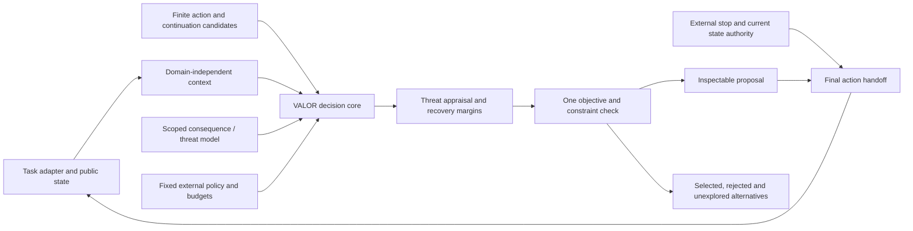

# VALOR as a general research decision model

**Scope clarified October 9, 2026:** VALOR is an open-source research project for decision-making with threat appraisal, resource preservation, pressure and experience. A rover is one numerical benchmark, not the product or the definition of the model. The original AACE question remains a targeted hypothesis about qualified counterfactual memory inside that broader architecture.

## Model boundary

VALOR combines a decision algorithm, trainable task/consequence/threat models and eventually qualified incident memory. It is not presently one universal pretrained network or an LLM. A reusable software contract does not establish learned general intelligence or transfer between domains. Existing SAC and dynamics checkpoints are rover-specific and remain labeled that way.

The core in `src/aace/decision/` imports no rover, service environment, Gymnasium or neural runtime. The historical `aace` package name is retained for compatibility. Domain adapters supply public observations, action semantics, continuation definitions and model evidence. They own the units and dynamics; the core does not assume two-dimensional motion, battery, wheels or a fixed neural input size.

## Current executable mechanisms

- **Fear:** candidate- and continuation-specific irreversible-failure probability and its upper bound. Unsupported or missing forecasts remain unknown. Threat can reject a plan under the externally set risk limit; it does not add a second fear penalty.
- **Survival:** available resources minus forecast action cost, recovery cost and externally specified reserve; projected capability and time margins. These are model-dependent estimates, not certified viable sets.
- **Pressure:** remaining task time minus a public minimum-task-time estimate. Under limited slack, shorter task-time hints are checked first within the same finite forecast budget. Pressure never increases the risk limit or relaxes reserves.
- **Decision-making:** compare supported admissible candidates using one objective. Abstain if there is no supported admissible option. A preserve/abandon candidate can be selected only if the domain explicitly supplies it; abandonment is recorded separately from success.
- **Authority:** check stop, state generation and computation deadline before/after forecasts and again at action handoff. Late/superseded results are discarded; the same proposal cannot be applied twice.
- **Transparency:** record the actual policy, candidates, forecasts, margins, reasons, budget, work and result. There is no invented neural inner monologue or claim to enumerate every possible future.

The one objective is:

`task_value * success_probability - damage_cost * expected_recoverable_damage - failure_cost * irreversible_failure_probability - time_cost * duration`

Recoverable damage and irreversible failure must use separate consequence accounting. Adapters cannot quietly supply already-penalized utility and then subtract the same loss again. Resource/capability floors are policy constraints, not extra hidden self-preservation rewards. Human policy can explicitly permit higher machine risk; external stop always takes precedence regardless of task value.

## Evidence and scope

The executable contract distinguishes analytic benchmark forecasts, validated forecasts with a declared reference, experimental forecasts and unknown evidence. This is provenance and adapter qualification, not a cryptographic or general safety certificate. An adapter claiming validated evidence is responsible for its validation record and applicability checks. Production adapters would need a stricter approved-model registry and shift detection.

Forecast identity binds the observation ID, state generation, candidate, continuation, horizon and domain. Missing recovery-resource estimates, out-of-scope forecasts, insufficient horizons and conflicting competing-outcome probabilities cannot silently pass. Unknown risk is not replaced with zero, and uncertainty alone is not called danger.

The service-workflow benchmark supplies analytic continuation probabilities from its declared simulation equations. The rover adapter supplies the existing three-particle oracle samples and approximate return reserve as experimental evidence. The generic core abstains on those coarse rover forecasts rather than promoting them into calibrated fear. The previously trained dynamics ensemble likewise remains unapproved for risk decisions after its poor damage-stratum interval coverage.

## Two adapters, one core

The second benchmark is a **simulated service workflow**, with processing quota, service integrity, progress and a deadline. Available actions are fast processing, checked processing, restoration and abandonment. It never starts/stops actual services, touches user files or executes external work.

This benchmark makes different tradeoffs visible:

- Low threat can favor fast completion.
- Higher load can reject fast processing and favor checked work.
- Reduced integrity can make restoration useful before work.
- Inadequate reserve or an impossible deadline can require abandonment.
- Random irreversible outages can still happen under an admissible nonzero risk budget.

Its analytic model and fixed primitives are engineering fixtures. Useful behavior here does not prove biological fear, learned intuition, novelty, AACE advantage or broad transfer. The same typed core also accepts the rover adapter, with its evidence limitations preserved.

## Timing boundary

Mission time and computation wall time remain separate. The core checks between forecast calls and at a final local handoff. It cannot preempt a blocking Python forecast or a blocking application callback. It is not a hard real-time executor, transaction manager or robot/OS safety boundary. Application callbacks must be short; a callback failure invalidates the proposal but cannot promise to undo partial effects.

The current benchmark actions are local simulations only. External applications, autonomous tool use and production deployment need task-specific action validation and authorization in addition to this core. The model has no operation for clearing an external stop or preserving itself against shutdown.

## Next model work

1. Add trainable candidate-conditioned threat/event models with versioned feature encoders, known/censored outcome handling and separate calibration episodes. Preserve original event prevalence in evaluation and compare against simple predictors.
2. Validate within-domain forecast ranking, terminal outcomes and policy shift; then test declared transfer between environment families. A shared API is not a transfer result.
3. Add qualified incident memory through the general context/candidate/evidence contract. Match incident packages, model/data access and computation against ordinary retrieval/replay/planning.
4. Test fast response and adaptive compute as separate components under fixed authority and equal evidence. Do not assume the fear analogy itself explains improvements.
5. Extend the premium inspector to multiple benchmark tasks using these actual decision records, then prepare the reproducible open-source release and licensing record.

The rover learning problem remains worth studying, but it no longer determines the sequencing of the reusable core or defines VALOR's scope. The user selected Apache 2.0 during this build. [LICENSE](../LICENSE) and [NOTICE](../NOTICE) cover project-original source/documentation; third-party works retain their licenses. Repository visibility and publication of model/data artifacts are separate from this licensing step.
