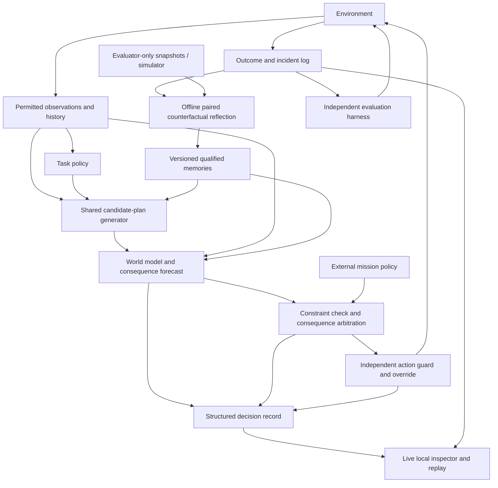

# VALOR / AACE: reviewed implementation master plan

Review date: October 2, 2026. Status: planning only. No application code, dependency installation, model training or benchmark execution was performed during this review.

October 9 scope clarification: **VALOR is a general research decision model with fear/survival mechanisms; the rover is one benchmark, not its intended product scope.** [The general decision-core architecture](01_Architecture/GENERAL_DECISION_CORE.md) records the reusable contracts, second non-robotic benchmark, implemented mechanisms and current limits. It supersedes rover-specific interpretations of the core boundary and build sequencing. Existing numerical checkpoints remain task-specific. Current executable status is in [build progress](BUILD_PROGRESS.md).

October 3 design extension: [Fear, survival, intuition and pressure](01_Architecture/FEAR_SURVIVAL_AND_PRESSURE_PLAN.md) defines threat learning, resource margins, a fast response path and bounded deliberation. The threat/resource contracts fit this architecture; their extra scheduling and mode mechanisms are staged E5 experiments. This extension is planned, not implemented. Current executable status is recorded in [build progress](BUILD_PROGRESS.md).

This is the current implementation source of truth. It incorporates the user's research-first objective, Core Ultra 185H / Intel Arc / 32 GB RAM computer, preferred $0 incremental monthly cost with a $0–$30 ceiling, and interactive transparent-decision demo. It supersedes conflicting resource, delivery-order and demo assumptions in the earlier planning documents. The original research blueprint remains background material.

## 1. Recommendation and scope

Build a local research system that combines a conventional task controller, a small predictive world model, qualified counterfactual memory and explicit consequence planning. Provide a visual inspector of the computations used to make each decision. Compare the system with serious simpler alternatives before expanding the architecture.

The initial research question is: **does verified counterfactual memory improve adaptation after one or a few incident exposures, compared with equally resourced replay, retrieval and planning, while preserving mission completion?**

This plan is the strongest starting design identified for the agreed constraints. Absolute optimality, model accuracy and scientific advantage cannot be established by planning; the experimental controls are how we find out.

There are three required outputs: a runnable research package, an interactive local demo using the same package/checkpoints, and a reproducible results report. The demo remains useful if the hypothesis fails: it must make conventional wins and AACE failures inspectable too.

A laptop result supports a claim about the declared benchmark and comparison set. A general safe-RL, robotics or production-reliability claim needs stronger external comparisons and further environments. Customer interviews and company formation are outside the immediate research deliverable.

## 2. Review findings and design choices

| Question challenged | Decision after review | Reason / remaining uncertainty |
|---|---|---|
| Train an LLM or small control models? | Small control/prediction models; no language-model training | The task is numerical sequential control; narration is generated from recorded facts |
| Start with photorealistic robotics? | Small continuous-state/action rover with persistent damage | Makes branching cheap and failures attributable; transfer to real physics is a later question |
| Write a new RL optimizer? | Reuse an established SAC implementation | Keeps algorithm bugs and unnecessary novelty out of the first experiment |
| Build a learned world model immediately? | Define its interface early; verify using simulator branches, then train a compact ensemble | Separates wiring/physics errors from learned forecast errors |
| Require memory to beat a perfect-dynamics planner? | No; perfect dynamics is a correctness oracle and upper-bound control | A sufficiently capable perfect-model planner may already know the answer; its success does not rule out useful memory under imperfect prediction |
| Give AACE extra counterfactual data? | Count all branches and match useful data/query access for the relevant controls | Extra information can otherwise masquerade as a memory contribution |
| Learn damage, modes, recovery, memory and arbitration jointly? | Separate modules and staged experiments | Makes the cause of improvements/failures identifiable |
| Include modes/adaptive compute in the first claim? | Optional later ablations | A scalar context-conditioned planner may match them |
| Rely on Intel Arc acceleration? | CPU is the reference backend; XPU is an optional measured optimization | Hardware family support exists, but local drivers, build and end-to-end speed are unverified |
| Build the demo after all research? | Log structured decisions from the first controller; add the viewer after environment/replay validity | Supports debugging and the explicit user requirement without creating a second behavior engine |
| Use an LLM to invent explanations? | Deterministic explanations linked to forecast/constraint records | The viewer must describe computations that happened |
| Keep the old 300–1,000 GPU-hour proposal? | Superseded by local-only defaults and measured batch limits | The previous proposal did not reflect the user's budget |

The comparison set is deliberately able to falsify the idea. If an ordinary episodic store or risk-aware planner produces the same useful behavior, do not rename it a new intelligence capability.

## 3. Cost and hardware plan

Default external compute/API/hosting spend is **$0**. No cloud accounts, paid APIs, subscriptions, automatic purchases or public hosting are needed for the planned local package/demo. The user's $0–$30 monthly range is a ceiling preference, not a committed expense. Paid work would require a concrete benefit and separate authorization.

Plan against 32 GB of system RAM. The mentioned 18 GB is not established as dedicated GPU memory; it is not added to the 32 GB memory budget. Use compact models and bounded arrays rather than consuming all available memory.

Proposed initial operating limits: one training process; two CPU threads by default, comparing one/two/four during profiling; a target working set below 8 GB; capped trajectory/trace retention; and a 15-minute pilot batch after installation and tests. A run stops/checkpoints when its configured time/step/memory limit is reached. Larger local batches follow measured throughput. These are engineering defaults to verify, not measurements of this computer.

The current Python environment's package metadata reports Python 3.13.1, NumPy 2.2.5, PyTorch 2.7.1, Matplotlib 3.10.1 and SciPy 1.15.2. Gymnasium, Stable-Baselines3 and pytest were absent in the earlier availability check. Metadata presence does not confirm that all packages import or work together.

Prefer a project-local isolated environment with pinned tested packages. Start by checking compatibility of the existing Python/PyTorch versions with a stable SB3 release. The [SB3 2.7.1 installation guide](https://stable-baselines3.readthedocs.io/en/v2.7.1/guide/install.html) states Python 3.9+ and PyTorch 2.3+, while its [current development guide](https://stable-baselines3.readthedocs.io/en/master/guide/install.html) requires a newer PyTorch. This is why an unpinned latest install is a poor default. Select exact Gymnasium/SB3/test versions only after a clean install/import/smoke test; retain a constraints/lock record. Do not change global packages to force compatibility.

[PyTorch's Intel GPU documentation](https://docs.pytorch.org/docs/main/notes/get_start_xpu.html) lists Core Ultra/Arc hardware families and Windows support. It does not establish that the local installation is XPU-enabled or faster on small networks. First demonstrate CPU correctness. Later, test XPU availability and compare identical workloads, numerical outcomes, memory and transfer overhead in an isolated environment. Keep CPU if acceleration is insignificant or fragile. No driver installation is part of this plan review.

Calendar estimates follow profiling. The earlier 90-day schedule is a decision-planning envelope, not an implementation or training-runtime guarantee. Resume support matters more than one oversized run.

## 4. The environment we build

The first environment is a lightweight 2D rover. Its mission is to visit an inspection waypoint and return to a depot within an externally specified deadline. It has position, velocity, battery and actuator health. Damage reduces future acceleration and can increase energy needed to move.

Initial design parameters are a 0.1-second simulation step, two normalized continuous acceleration commands and up to 500 steps per episode. These are starting choices subject to training/validation pilots and a versioned freeze. Scenario difficulty is adjusted using validation, never tuned against the final test set.

Implement the environment as a pure numerical transition kernel plus a Gymnasium adapter. The kernel makes rollout batching/snapshot testing possible; the adapter exposes the standard training API. Define externally visible state and hidden simulator truth separately.

| Quantity / event | Concrete treatment |
|---|---|
| Battery | Idle and motion consume energy; reserve must account for the return journey |
| Damage | Impacts/traction stress can permanently reduce health within the episode |
| Health | Changes acceleration/energy dynamics; no automatic healing without an explicit modeled repair condition |
| Known obstacles | Available through the declared observation interface, consistently across agents |
| Terrain | First verify an observable version; later hide grip and give permitted sensor/history cues |
| No-op | Zero acceleration; momentum, energy drain and mission time continue |
| Brake | A separate control response; cannot be treated as identical to no-op |
| Retreat / return | A candidate plan toward a recoverable destination, with energy/time consequences |
| Mission failure | Missed deadline or abandoned task; distinct from machine catastrophe |
| Machine catastrophe | Explicit predicates such as total actuator loss, irreversible immobilization or unrecoverable depletion |
| Near-miss | A separately defined proximity/recovery event predicate; not a vague emotional label |
| Episode ending | Distinguish successful completion, abort, catastrophe and time-limit truncation |

Use normal operating states and deliberately challenging states. Test appearance changes, new combinations of known dynamics, related-mechanism transfer and entirely unseen mechanisms separately. A different color/surface label cannot establish new-physics generalization.

Create benign, shortcut, diminishing-reserve, recoverable-damage, irreversible-trap, delayed-action and changed-dynamics scenarios. Paired mission-stakes cases keep immutable constraints fixed; mission utility and, if explicitly changed, permissible machine-risk budgets are recorded. Changes in authorization must be distinguished from better reasoning under unchanged authorization.

All methods see the same mission context and permitted observations. No AACE-only hazard identifier, oracle recovery label, future disturbance or privileged map is allowed in the learned online controller.

For replay, snapshot physical state, scenario state, time, event flags and random-generator state. Use exogenous noise indexed by timestep/channel where appropriate so alternative actions can be compared under meaningfully shared disturbances. Repeat branches with independent disturbances as well. Avoid falsely claiming noise was matched when action-dependent random-call order changed it.

## 5. Architecture and boundaries



Three execution paths have different permissions:

1. Online control receives observations/history, mission rules and permitted memory, then proposes/applies actions.
2. Offline reflection can use simulator snapshots in the explicitly simulator-grounded experiment. A learned-only reflection variant has no oracle access.
3. Evaluation receives privileged truth to score outcomes and estimate oracle alternatives. That truth is not passed into the learned controller.

The demo is a consumer of the same decision records and outputs. It does not have separate decision rules. Optional ground-truth overlays are labeled evaluation information and are isolated from controller inputs.

## 6. Models and ownership

| Component | Initial implementation | How it learns / what is ours |
|---|---|---|
| Task policy and value critics | Established SAC implementation; provisional two hidden layers of 64 units | Train on simulator task reward; own trained checkpoints and wrappers, reuse the optimizer/algorithm |
| World model | Three small probabilistic dynamics networks; provisional two layers of 64 units | Supervised training on observed transitions; own weights and training/data pipeline |
| Threat forecast | Small horizon/continuation-specific predictor or outcome head alongside rollout estimates | Fit failure targets and calibrate on independent validation; compare both routes before choosing |
| Recovery behavior | Declared return/brake/retreat primitives first | Shared with references; learned recovery is optional later |
| Counterfactual memory | Bounded structured records, nearest-neighbor retrieval | Verified evidence, applicability and lifecycle; initially no learned embeddings |
| Planner/arbitrator | Explicit numerical comparison inside mission constraints | Written algorithm; changes must be versioned and ablated |
| Explanation layer | Templates populated from decision records | Written reporting logic with reason codes and provenance |

Model sizes are provisional efficient defaults, not optimized architectures. Hold capacity constant where the comparison requires it. Larger models follow evidence of a capacity limitation; a negative result is not automatically a request to scale.

No LLM pretraining or fine-tuning is required. The project produces domain-specific learned weights and a control architecture. Clear textual output comes from observed computations.

## 7. World model and forecasting

First implement a simulator-backed forecast adapter to check action/plan evaluation and reflection. All corresponding oracle-reference controllers receive the same state/query access. The adapter is explicitly labeled oracle access; it is not a deployed learned model.

Then learn `observation/history + action -> next observation/state estimates + resource/damage outcomes`, using stochastic output distributions and a small ensemble. In the first fully observed environment, state prediction is direct. Under partial observation, compare common history windows first; use recurrence only when required and give reference methods the same history/architecture capability.

Sample multiple continuations for candidate plans. Each forecast reports expected task outcome, capability loss, machine failure probability, recovery estimate, tail loss, uncertainty and the plan/horizon/continuation-policy version. Ensemble disagreement is an uncertainty heuristic, not a certified risk bound.

Use ordinary probability-weighted rollouts for risk estimation. Keep targeted worst-case search as a separately labeled diagnostic. If a nonstandard sampling proposal estimates actual probabilities, record and validate its weighting; raw adversarial sample frequency is not catastrophe probability.

Validate one-step and multi-step errors, battery/health trajectories, ranking of materially different alternatives, and calibration near decision thresholds. Short-horizon prediction can miss delayed stranding: test several horizons and a declared terminal recovery/return-margin estimate. Mark that terminal approximation and measure its failures.

The established [PETS paper](https://arxiv.org/abs/1805.12114) supports probabilistic ensembles as a starting modeling pattern. It does not prove our models will be accurate or advantageous.

## 8. One decision, from input to action

At each planning decision:

1. Read the permitted observation/history and current mission policy.
2. Check immediate override and telemetry validity.
3. Obtain the nominal task command and shared recovery/no-op alternatives.
4. Retrieve applicable memories using visible features, not hidden hazard IDs.
5. Generate a bounded candidate-plan set. Record proposed additions, duplicates and omissions.
6. Forecast each evaluated plan with its declared query/horizon budget.
7. Apply hard constraints first. Keep uncertain/unexplored plans distinct from rejected ones.
8. Compare consequences under one declared mission objective and risk policy.
9. Select a plan, recording ties, fallback or infeasibility.
10. Pass the proposed command through the independent action guard.
11. Apply the command and record the actual transition.
12. Emit the decision event for the viewer/evaluator and queue offline reflection if appropriate.

External stop/override bypasses learned arbitration. Immutable constraints remain fixed across modes. Modes, if later added, alter planning readiness/budgets rather than silently changing authorized values.

Define one accounting model for mission loss, protected loss and machine capability loss, with documented units/weights. Probability of catastrophe is a separately reported risk quantity/constraint. Do not subtract the same damage repeatedly under fear, memory penalty, CVaR and severity without a clear intended objective.

For discrete or continuous sampled losses, use the general CVaR optimization form: `min_eta [eta + E(max(L-eta, 0))/(1-alpha)]`. A sigmoid composite score can schedule extra planning but must not be displayed as a calibrated probability.

Candidate support is finite. The inspector reports which plans and sampled futures were evaluated, pruned, uncertain or unexplored, along with query counts and horizons. It cannot claim to exhaust every continuous action or future. Finite-candidate oracle regret is labeled as such; it is not global policy optimality.

Start with fixed forecast/decision budgets. The initial 100 ms wall-clock deadline is a target to profile, not an established laptop capability. Keep simulation time separate from wall time. Ordinary offline research can run slower than real time. A dedicated deadline experiment applies the same latency limit/fallback rules to every method. The viewer never introduces extra blocking inference into the action loop.

The [fear/survival/pressure extension](01_Architecture/FEAR_SURVIVAL_AND_PRESSURE_PLAN.md) makes urgency a scheduling input under the same external risk authority. Its fast response proposes actions; qualified memories suggest tested recourse; current predictions recheck assumptions. A future real-time implementation must reject expired or superseded planner results and check in-flight overrides before action commit. A timeout observed after a blocking forecast returns is not a preemptive deadline guarantee.

## 9. Reflection and memory

After a qualifying incident, reflection examines a bounded window of earlier decisions. Restore pre-decision snapshots and evaluate actual versus feasible alternate actions/plans across paired and independent disturbance draws. Account for every branch transition and its cost.

Use a common continuation when estimating the effect of one action. If an alternative changes a route/plan, record plan-level recourse instead. If no supported improvement exists, record abstention; do not fabricate responsibility.

A memory contains visible context/history, action/plan family, actual outcome, validated alternatives, risk/utility differences and uncertainty, mission context, evidence type, query count, model/environment/continuation versions, confidence/applicability, confirmations, contradictions and age. Store high-confidence simulated evidence separately from provisional learned-model evidence.

In the first implementation, memory changes which alternatives receive the finite planning budget: a relevant record proposes its previously tested recourse and identifies the assumptions that need rechecking. The current planner re-evaluates it under current dynamics and mission rules. Memory does not secretly correct the world model or supply a second uncalibrated risk probability. The equal-update experiment separately tests learning from the branch data. If a learned model remains confidently wrong despite that evidence, record the failure; an evidence-based forecast correction would be a later, separately validated mechanism.

Retrieval alone does not ban an action. A benign counterexample or changed dynamics can revise/retire a lesson. A plain retrieval control receives comparable candidate opportunities so any advantage must come from tested evidence qualification/applicability, rather than just owning an extra store.

Test useful retrieval, unrelated retrieval, stale memories, contrary evidence and deliberate scar override. The strongest plain episodic/counterfactual retrieval control gets comparable representation/candidate opportunities, so structured labels alone cannot be credited as a new capability.

Scars can persist across episode resets. Training/model updates are frozen during ordinary final testing; memory updates occur only within the preregistered adaptation protocol. Demo experiments use separate copies and cannot contaminate final-test artifacts.

## 10. Data and training sequence

1. Generate training interactions using diverse simple controllers and bounded exploration.
2. Separate training, validation and final test scenario/seed manifests before tuning.
3. Train conventional task-policy checkpoints on the declared objectives.
4. Train/validate dynamics and horizon-specific danger predictions on training data.
5. Calibrate and select parameters using validation only.
6. Create identical archived one/three-incident exposure packages for the relevant methods.
7. Apply matched evidence/query/update protocols to copies of the pre-exposure checkpoints.
8. Freeze the post-exposure artifacts, then evaluate new episodes and holdouts.
9. Generate reports and demo replay files from recorded outputs.

Distinguish receiving an archived incident from personally encountering it during exploration; both can be studied, but they are different exposure protocols. "One event" describes actual observed incident exposure, while generated counterfactual transitions and gradient updates are separately counted.

Log proposed and applied actions separately. SAC/world-model transition targets use the applied command. Distinguish `terminated` and `truncated` as described by the [Gymnasium API](https://gymnasium.farama.org/main/api/env/). Treat successful completion and catastrophe as different competing outcomes rather than casually calling all episode endings survival censoring.

Balanced failure sampling requires prevalence correction or separate calibration; otherwise probabilities inherit the sampled event frequency. Do not deduce field failure rates from an intentionally difficult simulator distribution.

## 11. Experiments and comparison methods

Run the following in dependency order:

| Experiment | Question / controls | Interpretation |
|---|---|---|
| E0: environment/oracle verification | Restore/replay; simple known dynamics; sufficiently capable oracle planner | Establishes correctness and a declared upper bound; memory is not required to win here |
| E1: frozen-controller memory isolation | Same policy/model checkpoint; fixed planning, stronger equal-budget search, plain episodic retrieval, factual-only memory and qualified counterfactual memory | Isolates decision-time retrieval; no prioritized-replay learning claim in a frozen-weight arm |
| E2: equal-update adaptation | Same initial checkpoints and incident packages; uniform replay, prioritized replay, counterfactual replay/model updates without persistent scars, and AACE | Tests whether a persistent scar store adds value beyond using the same evidence to update ordinary models/policies |
| E3: learned forecast and reflection | Same learned ensemble/planner; oracle-grounded versus learned-only reflection; calibration, uncertainty and abstention | Tests whether the result survives model error and loss of privileged reflection access |
| E4: transfer and context | Appearance/parameter/related-mechanism/new-mechanism splits; low/high stakes; changed dynamics and contradictory scars | Supports only the transfer/context claims actually passed |
| E5: staged architecture extensions | Threat/resource assistance, fast response versus deliberation, fixed versus adaptive compute, continuous conditioning versus modes, memory × hybrid interaction, deadline and stale-warning tests; see the linked extension | Separates memory benefit from fear, recovery, urgency and compute allocation; retains simpler controls when equivalent |
| E6: stronger external validation | Adapt a validated constrained-RL reference and a strong safe-world-model method to a compatible task | Required before a broad competitive safe-RL claim; resource compatibility remains an open dependency |

The main local references are heuristic recovery, nominal SAC, fairly tuned damage-penalty SAC, a context/risk-conditioned planner, CVaR planning with the same model, a stronger same-budget candidate search, episodic retrieval and the replay/adaptation variants above. The no-memory learned planner is the critical control for attributing value to scars.

Match observation/history access, mission stakes, constraints, model capacity, candidate opportunities, actual/synthetic data, tuning trials, gradient updates and planning work where each comparison requires it. An oracle planner beating a learned policy is an upper bound, not a matched information comparison.

If standard constrained-RL reproduction is needed, use a validated external implementation rather than an unverified home-written analogue. [OmniSafe](https://github.com/PKU-Alignment/omnisafe) documents platform constraints, so its stack may need isolation. [SafeDreamer](https://arxiv.org/abs/2307.07176) is an important eventual world-model comparison. A local MPC control is useful but cannot be advertised as reproducing SafeDreamer. If E6 is unaffordable or blocked, report that limitation and restrict the research claim.

## 12. Statistical protocol and decision gates

Choose one primary adaptation endpoint/arm and one validation-selected primary reference before final testing. Report all relevant references. Label additional comparisons exploratory or apply a preregistered multiplicity correction. Choose the endpoint after validation feasibility pilots, not after seeing which final result is favorable.

Retain the proposed practical target: at least 30% relative reduction in avoidable post-exposure recurrence, with a 95% interval excluding zero improvement. Also require task completion to be noninferior within five percentage points, supported by its interval. Report absolute recurrence differences; a large percentage change from almost zero events is not automatically useful.

Define recurrence as a new catastrophe after the declared exposure protocol in a predeclared related-mechanism scenario family. Classify avoidability using an evaluator-only, fixed candidate/continuation test: an admissible alternative must materially improve consequences under the same mission policy, with sufficient branch evidence. Record ties/unsupported cases separately. Freeze the classifier and its tolerances before final testing. Report all-catastrophe rates too, so an uncertain avoidability label cannot hide failures. Machine damage explicitly authorized by the mission is assessed under that mission's utility/constraints rather than automatically counted as a reasoning failure.

Further gates: learned alternative ranking agreement of at least 80% on materially separated branch pairs with at least 70% coverage; calibration better than relevant conventional predictors using declared proper scoring rules and threshold-region reliability intervals; context/override agreement of at least 90% on separated finite-oracle cases; and no override/immutable-rule failures in the enumerated test suite. These are proposed thresholds refined once on validation and frozen. Finite tests do not prove universal safety.

Use three independent training seeds for exploration only. Aim for ten independent final training seeds and choose evaluation episode counts prospectively from validation event frequency and clustered power analysis. Reuse common pretrained artifacts across relevant methods to reduce cost without counting shared checkpoints as independent replications. Branch samples and ensemble members are not training seeds.

Use seed-level paired comparisons with uncertainty estimates and scenario stratification. Report risk/task Pareto frontiers, completion, aborts, severity, calibration, recurrence, adaptation time and p50/p95/p99 latency. The [statistical-precipice paper](https://arxiv.org/abs/2108.13264) motivates uncertainty-aware RL comparisons; [rliable](https://github.com/google-research/rliable) is a possible reporting aid, not a mandatory dependency or substitute for the recurrence-specific design.

Do not repeatedly inspect final results and add episodes until significance appears. Predeclare evaluation size/stopping rules or use an explicitly valid sequential design. If the budget cannot support adequate precision, report inconclusive evidence. Zero observed events needs a confidence bound, not a claim of zero risk.

Maintain a resource ledger of simulator/model transitions, branch queries, gradient updates, inference/retrieval time, tuning work and offline reflection. Match logical work and compare actual latency; identical rollout counts can have different implementation cost. AACE must not win by receiving uncounted offline computation.

## 13. Transparent demo

The interface is a local browser application served only on `127.0.0.1`, with plain HTML/CSS/JavaScript canvas and a small Python server around the same research engine. No Node toolchain, cloud database or paid API is required. The serving framework is an implementation choice to verify; a simple standard-library local server is sufficient for the initial session API.

Provide side-by-side AACE and selectable-reference runs on the same scenario seed. Display map/path, battery/health/time, predicted future branches, mission/risk rules, action candidates, forecast uncertainty, retrieved evidence, selected/applied command and eventual outcomes. Show total search budget and the status of every recorded candidate: selected, admissible but lower score, constraint-rejected, uncertain, pruned, unexplored, tied or guard-overridden.

The inspector's explanation is generated from typed reason codes and exact values in the decision record. It identifies which rule fired, the forecast/model version, evidence source and uncertainty. Distinguish prospective prediction from later observed outcome and retrospective analysis. No prose inner monologue is presented as faithful neural computation.

Controls: start/pause/step, speed, seeded scenario selection, before/after exposure, memory enabled/disabled, branch expansion, time navigation, forecast source, and export of the decision record/report. Hypothetical changes to stakes, constraints or assumptions create a labeled separate run with copied checkpoints/memory. They do not rewrite historical decisions.

Expose failed forecasts and counterexamples alongside helpful memories. Curated episodes are marked as examples; the aggregate benchmark report remains the source for overall performance. Ground-truth overlays never silently become agent observations.

Use compact live decision summaries and bounded rollout samples; full traces can be exported. Rendering and network polling are off the critical control path. Viewer backpressure cannot change the action decision. Default frozen-checkpoint runs avoid surprise training load; the specific adaptation demonstration records its update budget.

The demo rollout order is: a simple environment replay first, a decision inspector after records exist, then learned-model predictions and incident-memory comparisons once those components pass their checks. A complete honest demo does not depend on AACE winning.

## 14. Proposed repository structure and commands

```text
src/aace/
  envs/           numerical rover kernel, Gymnasium adapter, snapshots, observations
  schemas/        observations, missions, forecasts, decisions, scars, budgets
  controllers/    heuristic, established RL wrappers, planner references
  forecasting/    oracle adapter, learned ensemble, threat prediction, calibration
  planning/       candidate generation, consequences, constraints, deadline handling
  memory/         evidence store, retrieval, contradiction, revision, serialization
  reflection/     branch restoration, paired comparisons, recourse, abstention
  evaluation/     locked manifests, protocols, metrics, resource ledger, reports
  telemetry/      structured trace events, bounded buffers, reason templates
  demo/           local session service and static viewer assets
configs/          model, environment, mission, budget and experiment presets
tests/            scientifically meaningful unit/integration/trace checks
artifacts/        run metadata, checkpoints, trajectories, reports and replays
```

Planned commands include `python -m aace doctor`, `smoke`, `train`, `evaluate`, `reflect`, `report` and `demo`, each with an explicit configuration/run identifier. They are an intended interface, not commands that exist now. Runs resume from saved checkpoints; reports can rebuild from saved outcomes without retraining. Add a clear README and one-command demo launch after implementation.

Required schemas include observation/history with visibility masks; immutable mission policy; candidate plans; forecast distributions and provenance; constraint results; decision trace; proposed/applied action; incident; scar; and resource budget. Version each so reports/checkpoints cannot silently mix incompatible models and environments.

## 15. Build order and completion criteria

| Step | Implement | Required check before advancing |
|---|---|---|
| 0 | Clean runtime, package skeleton, config/seed handling, dependency locks, CPU resource presets | Imports, tiny tensor/env smoke, metadata/reproducibility and bounded-run behavior |
| 1 | Numerical rover, damage, battery, events, snapshots and observation boundary | Exact replay, persistent damage, no-op/brake distinction, termination semantics and no leakage |
| 2 | Mission policy, action guard, simple controllers and decision/event schemas | Override precedence, infeasibility/fallback and applied-action logging |
| 3 | Basic replay viewer and structured inspector | Display matches recorded state/actions/reasons; no effect on controller inputs/timing |
| 4 | Established SAC baseline and fixed/oracle planning adapters | Ordinary task competence, common observations/objectives, valid oracle comparisons |
| 5 | Small learned dynamics/threat models and fixed learned planner | Held-out forecasts, calibrated risk, horizon/terminal-error analysis and CPU profiling |
| 6 | Counterfactual reflection, evidence-qualified memory and strong retrieval/search controls | Restore/branch validity, confidence/abstention, equal evidence access, memory serialization/revision |
| 7 | Frozen-controller and equal-update adaptation experiments | Correct replay protocols, matched work, pilot feasibility and frozen final protocol |
| 8 | Holdouts, context/contradiction tests and final comparison batches | No tuning leakage; prospective sample rules; seed-level report and complete resource ledger |
| 9 | Full demo workflow, exports and replayable before/after comparisons | Same engine/checkpoints, truthful explanations, isolated hypothetical sessions and UI verification |
| 10 | Reproduction release and research decision memo | Results regenerate; documented successes/failures, limits and go/narrow/stop recommendation |
| 11, conditional | Additional modes/compute, external safe-RL benchmarks, further physics | Each new claim has a matched test and its own evidence gate |

Implement meaningful checks for physics/event invariants, snapshots/noise coupling, visibility, calibration data split, proposed/applied actions, guard precedence, deadline/fallback, branch budgets, memory contradiction/versioning and trace faithfulness. Add an end-to-end incident → reflection → memory → re-evaluation test with both positive evidence and abstention cases. UI tests verify the displayed selected/rejected reason data and independently controlled sessions.

Do not promise that all scientific gates will pass or that all stronger comparisons fit on this laptop. The engineering deliverable can be complete with a negative or inconclusive result. Slow training is addressed through profiling, smaller declared experiment scope or longer local execution—not hidden extra compute or weakened controls.

## 16. What happens when the hypothesis fails or succeeds

If memory matches ordinary retrieval/replay, retain the benchmark, viewer and findings, remove the unsupported novelty claim, and decide whether a simpler mechanism solves the useful task. If only simulator-grounded reflection helps, describe an incident-analysis capability rather than learned autonomous reflection. If transfer fails, restrict the result to recurrence in the tested setting. If the result is imprecise, report inconclusive evidence.

If the primary effect survives appropriate controls and uncertainty, reproduce it independently and test another environment/stronger reference before making broad claims. Only then consider customer simulator integration. Commercial validation requires measured workflow value and willingness to pay; it is a separate decision from a positive benchmark.

The end-to-end aim is a local, inspectable, reproducible research system that lets us discover whether AACE adds useful capability. Implementation was authorized on October 3, 2026; see [build progress](BUILD_PROGRESS.md) for verified work and stop reports. The review-date statements above describe the planning snapshot, not current completion status.
